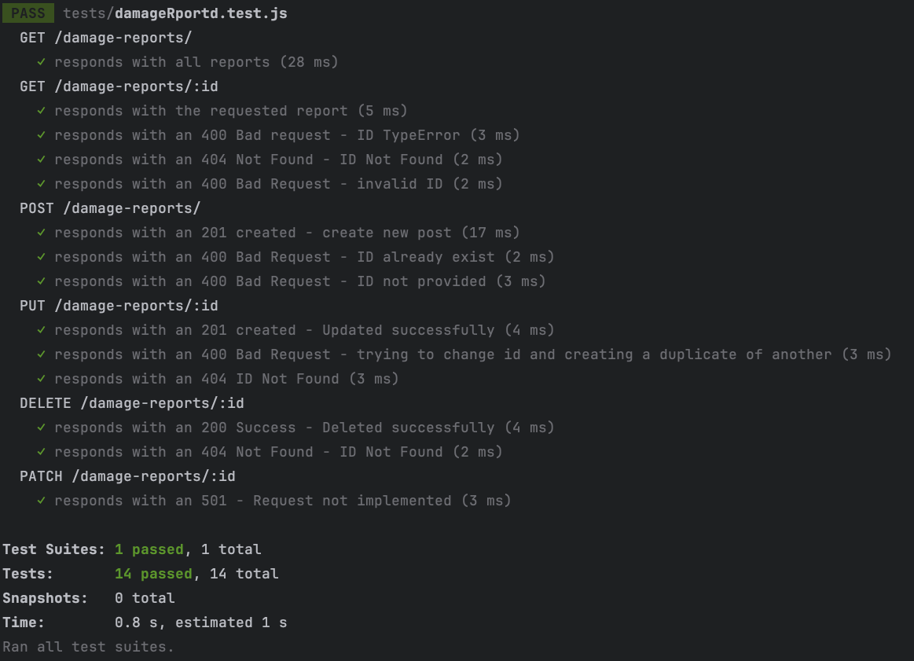

# Express Damage Reporting Tool

A simple server application for receiving and handling client requests using Express.

### Created by Rony Zrihen

## Table of Contents

- [Installation](#installation)
- [Usage](#usage)
- [Features](#features)
- [Running Tests](#running-tests)
- [Postman Examples](#postman-examples)

## Installation

Provide instructions on how to install and set up your project. Include any dependencies that need to be installed and any configuration steps required.

### Clone the repository

```bash
git clone https://github.com/ronyzrihen/express-reporting-tool.git
```

### Install dependencies

```bash
npm install
```

## Usage

Add a **.env** file with your own Database info like so:

```plaintext
# .env file
DB_HOST=[your DB host]
DB_NAME=[your collection name]
DB_USER=[your DB user]
DB_PASS=[your DB password]
```

```bash
# Run the application
npm start
```

Below is a list of supported requests the server can handle:

**GET**: Returns reports from the DB.

To get all reports, run:

```bash
# Get all reports
http://localhost:3000/damage-reports/
```

If you want to get a single report, run:

```bash
# Get report by ID
http://localhost:3000/damage-reports/5
```

The server can handle errors like:
- Type Error: bad ID provided
- Invalid ID: invalid ID value
- Not Found: ID not found

**POST**: Creates a new report.

To create a new report, run:

```bash
# Create a report
http://localhost:3000/damage-reports/
```

Body example:

```json
{
  "id": 4,
  "type": "Structural",
  "desc": "London Bridge is falling down, falling down OMG falling down!!!"
}
```

The server can handle errors like:
- ID Exists: requesting to create a duplicate ID
- Property Not Provided: ID not provided

**PUT**: Updates an existing report.

To update a report, run:

```bash
# Update a report
http://localhost:3000/damage-reports/[insert ID]
```

Body example:

```json
{
  "id": 4,
  "type": "Structural",
  "desc": "London Bridge is falling down, falling down OMG it's falling down!!!"
}
```

The server can handle errors like:

- Property Not Found: ID not found
- ID Exists: trying to update ID to an existing one

**DELETE**: Deletes an existing report.

To delete a report, run:

```bash
# Delete a report
http://localhost:3000/damage-reports/[insert ID]
```

The server can handle errors like:

- Not Found: ID not found

## Running Tests

The application has a testing script using Jest.

To run the tests, use the following command:

```bash
# Run tests
npm run test
```
### If everything runs smoothly, you should expect to see something like this.

## Features

The server consists of the following components:

- **index.js**: This file serves as the server bootstrap and is responsible for initializing and running the server.
- **server/server.js**: This file contains the Express application and is responsible for handling routing and other middleware configurations.
- **server/app.js**: Designed to decouple the main server middleware from the "app.listen" process, this file facilitates testing purposes by separating out critical middleware configurations.
- **router/damageReportRouter.js**: Serving as an HTTP handler, this module manages the routing of requests and responses to and from the server's logic.
- **controller/damage_controller.js**: This controller module is tasked with managing the server's logic, including the handling of business rules and error checking.
- **repository/damage_repository.js**: Responsible for handling requests to the server's database, this module interacts with the database layer to perform CRUD operations.
- **db/dbConnection.js**: Specifically tailored for interacting with MongoDB using Mongoose, this module establishes connections to the database and enables direct interaction.
- **models/Damage.model.js**: Housing the schema and model definitions for data insertion into the database, this module provides the structure for storing data.
- **middlewares/**: This directory contains middleware functions dedicated to handling errors and generating error logs, ensuring robust error management within the server application.


## Postman Examples

To facilitate testing and interaction with the API endpoints, you can import the following Postman collection that includes example requests for each supported endpoint:

[](https://documenter.getpostman.com/view/32069376/2s9YyzeJyC)

Clicking the button will import the collection into your Postman workspace, allowing you to explore and interact with the API.

Enjoy! :)

